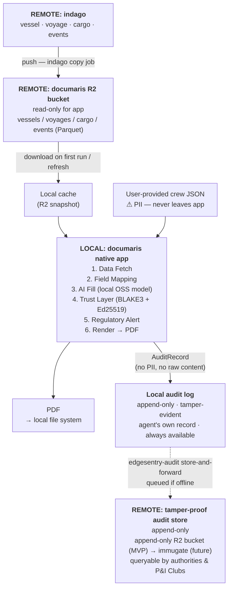
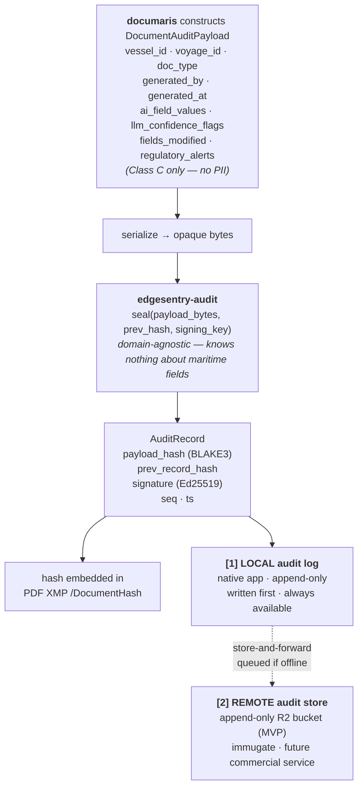
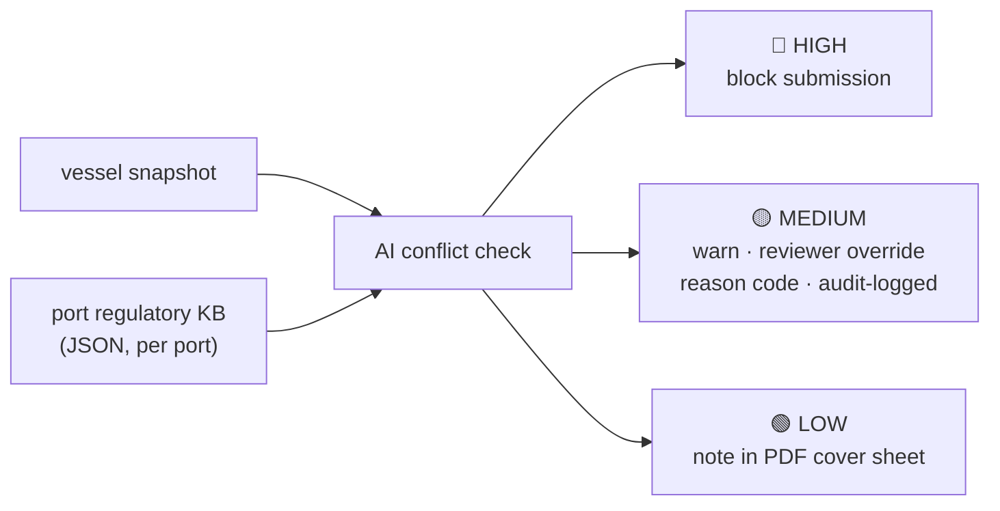
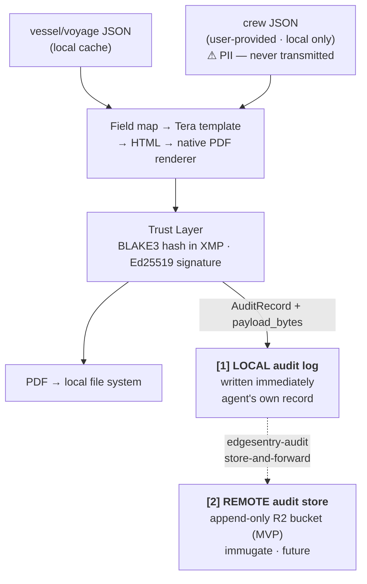

# documaris — Architecture

- **Date:** 2026-04-26 (updated from 2026-04-24)
- **Status:** Core design defined; R2 schema contract and PII boundary pending sign-off
- **Delivery:** Native desktop app (macOS / Windows / Linux); local open-source AI model (Apache 2.0 / MIT, model TBD)
- **Key invariants:** vessel/voyage/cargo data pulled from documaris R2 bucket (indago copies into it); crew PII supplied by user locally; only BLAKE3 hash transits the network

---

## System overview



---

## Layer 1 — Data Fetch

documaris reads exclusively from its own Cloudflare R2 bucket. indago is responsible for copying the data documaris needs into this bucket. This keeps the dependency clean: indago serves multiple applications (arktrace, documaris, and future products) and adding direct cross-app R2 bucket access would create tight coupling between consumers.

**Responsibility split:**

| Responsibility | Owner |
|---|---|
| Ingesting raw vessel, voyage, cargo, and AIS data | indago |
| Transforming and writing data to the documaris R2 bucket | indago (copy job) |
| Reading from the documaris R2 bucket | documaris app only |
| Schema of the documaris R2 bucket | Agreed jointly at M0; owned by documaris |

**documaris R2 layout (target schema — copy job implemented by indago):**
```
s3://documaris-bucket/
  vessels/vessel_id=IMO1234567/data.parquet   ← name, flag, IMO, GT, LOA, certificates
  voyages/voyage_id=V20260424/data.parquet    ← departure/arrival port, ETA, ETD
  cargo/voyage_id=V20260424/data.parquet      ← HS codes, quantities, DG flags, BL refs
  events/vessel_id=IMO1234567/2026-04-24.json ← AIS position fixes, port entry/exit
```

> **Schema contract (M0):** the documaris R2 partition layout is the interface contract between indago and documaris. It must be agreed before Milestone 0 completes. indago's existing R2 output (AIS and vessel scoring data for arktrace) uses a different schema; the copy job for documaris is a separate pipeline that indago must implement without modifying its existing outputs.

DuckDB runs in-process (Rust `duckdb` crate, `bundled` feature) to JOIN across Parquet files with a single SQL query and output a flat JSON record. The `object_store` crate (`aws` feature) handles S3-compatible download from the documaris R2 bucket; swapping to a local file system for development requires no code change.

**Crew PII is never stored in R2.** It is provided by the user directly inside the native app and never leaves the local machine (see Layer 6 and the privacy boundary section).

**Key dependencies:**
```toml
object_store = { version = "0.10", features = ["aws"] }
duckdb       = { version = "1.1", features = ["bundled"] }
tokio        = { version = "1", features = ["full"] }
```

---

## Layer 2 — Field Mapping

Each document type has a `field_map.json` that maps every form field to its indago source and specifies how it should be filled:

```json
{
  "form_field": "brief_cargo_description",
  "source": "indago.cargo.manifest_summary",
  "type": "llm_summarise",
  "llm_required": true,
  "llm_prompt": "Summarise the cargo manifest in one line suitable for IMO FAL Form 1 field 13."
}
```

Field types: `direct` (copy as-is) · `llm_summarise` · `llm_translate` · `llm_infer` · `computed`.

This schema is the formal contract between indago's data layout and documaris's form templates. It must be agreed before Milestone 0 begins. Field source paths use the `indago.*` namespace (e.g. `indago.cargo.manifest_summary`).

---

## Layer 3 — AI Fill

The AI fill layer is decoupled from any specific model or delivery mechanism behind a Rust trait:

```rust
#[async_trait]
pub trait LlmProvider: Send + Sync {
    async fn fill_field(&self, req: &FieldFillRequest) -> Result<FieldFillResponse, LlmError>;
    async fn extract_image(&self, image: &[u8], schema_hint: &str) -> Result<Value, LlmError>;
}
```

Swapping local vs. cloud, or native app vs. server, is a `config.toml` change; no code change required.

> **⚠ Implementation under review:** The specific model selection (local open-source model vs. cloud API) and delivery mechanism (native app vs. web app) are being evaluated. Options under consideration include distributing a permissively licensed (Apache 2.0 / MIT) model with the application to eliminate cloud API costs and network dependencies. Model names and provider details will be specified once the architecture decision is finalised.
>
> **Apache 2.0 / MIT compatible model candidates:**
>
> | Model | Licence | Size | Notes |
> |-------|---------|------|-------|
> | [Llama 3.2 3B Instruct](https://huggingface.co/meta-llama/Llama-3.2-3B-Instruct) | Llama 3.2 Community (≈Apache 2.0 for <700M MAU) | 3B | Good instruction following; runs on CPU via llama.cpp / MLX; already used in clarus explain step |
> | [Qwen 2.5 3B Instruct](https://huggingface.co/Qwen/Qwen2.5-3B-Instruct) | Apache 2.0 | 3B | Strong multilingual (EN/JA/ZH); relevant for Japan NACCS Phase 2 |
> | [Qwen 2.5 7B Instruct](https://huggingface.co/Qwen/Qwen2.5-7B-Instruct) | Apache 2.0 | 7B | Higher accuracy for llm_summarise / llm_translate fields; requires ~6 GB RAM |
> | [Mistral 7B Instruct v0.3](https://huggingface.co/mistralai/Mistral-7B-Instruct-v0.3) | Apache 2.0 | 7B | Strong instruction following; well-tested with llama.cpp GGUF; European regulatory text |
> | [Phi-3.5 Mini Instruct](https://huggingface.co/microsoft/Phi-3.5-mini-instruct) | MIT | 3.8B | Compact; runs efficiently on CPU; good for short structured-output tasks (field inference) |
>
> Selection criteria: the chosen model must handle `llm_summarise`, `llm_translate` (EN/JA minimum), and `llm_infer` field types at acceptable quality. Offline-first constraint favours 3B–7B GGUF models runnable via llama.cpp with no GPU requirement.

**Capability requirements (delivery-mechanism-independent):**

| Task | Requirement |
|---|---|
| Direct field copy | No AI needed |
| Cargo summary, FAL free-text | Multilingual text generation (English / Japanese) |
| Japanese field fill / translation | Japanese language support required |
| Regulatory conflict detection | Structured JSON output with confidence score |
| Japanese handwriting OCR + hanko (Phase 2) | Vision / multimodal capability required |
| Long-context multi-document reasoning | Extended context window required |

All prompts request structured JSON output with a `confidence` field. Low-confidence fields surface as UI warnings and are never silently auto-submitted.

---

## Layer 4 — Trust Layer

Implemented by reusing **`edgesentry-audit`** — the shared Rust crate from [`edgesentry-rs`](https://github.com/edgesentry/edgesentry-rs) (`blake3 = "1.5"`, `ed25519-dalek = "2.1"`). No new crypto code is written in documaris.

```toml
[dependencies]
edgesentry-audit = { git = "https://github.com/edgesentry/edgesentry-rs", tag = "v0.1.0" }
```

**Remote audit store — MVP and future:**

> **MVP:** an append-only Cloudflare R2 bucket. Tamper-evidence comes from the hash chain and Ed25519 signatures produced by edgesentry-audit — not from R2's storage guarantees. The bucket is write-only (no DELETE, no overwrite); any modification to a stored record breaks the chain and is detectable.
>
> **Future:** **immugate** — a commercial service to be built by this team, providing a dedicated tamper-proof audit log with a public Merkle-tree verification API. immugate is not yet built; the R2 bucket is the production interim. The store-and-forward endpoint in edgesentry-audit is the only change needed when immugate ships.

**Responsibility boundary — edgesentry-audit is domain-agnostic:**

`edgesentry-audit` is an independent library. It knows nothing about vessels, voyages, documents, or AI fields. It receives opaque bytes and returns a sealed record. All maritime semantics live in documaris.



**edgesentry-audit's public interface (simplified):**
```rust
// All documaris-specific fields are in the opaque payload_bytes.
// edgesentry-audit seals whatever bytes it receives.
fn seal(payload_bytes: &[u8], prev_hash: Hash32, key: &SigningKey) -> AuditRecord;
fn verify(record: &AuditRecord, payload_bytes: &[u8]) -> bool;
// store-and-forward: knows only the endpoint URL, not the payload semantics
fn queue_and_sync(record: AuditRecord, payload_bytes: Vec<u8>, endpoint: &Url);
```

**Tamper-evidence is structural, not policy:**
- **Hash chain:** each record includes `prev_record_hash`. Inserting, modifying, or deleting any record breaks all subsequent hashes in the chain — detectable by any party holding a copy.
- **Ed25519 signature:** each record is signed with the operator's key. Modifying a record breaks its signature.
- **Dual copy:** the local log and the remote log can be cross-verified against each other. An attacker would need to compromise both simultaneously to suppress evidence.
- **Sequence numbers:** gaps in the sequence are detectable — records cannot be silently dropped.

**What the audit log records (no PII, full action trace):**

| What happened | What's recorded |
|---|---|
| Document generated | who, when, which vessel/voyage (by ID), document type |
| AI filled a field | what text was generated, confidence score |
| Reviewer accepted a low-confidence field | that they accepted it, the confidence at the time |
| Reviewer corrected a field | before value, after value, editor identity |
| Regulatory alert raised | severity, rule triggered, resolution action |
| MEDIUM alert overridden | reason code entered by reviewer, their identity |
| Document hash embedded in PDF | the hash (not the document content) |

**Root cause analysis:** agents and authorities can query either copy to reconstruct the exact sequence of actions that produced a document — without retrieving any crew PII. Whether a port rejection was caused by an AI error, a reviewer override, post-generation tampering, or a source data issue is answerable from the audit log alone.

**Verification:** `GET /audit/verify?hash=<blake3_hex>` → `{ "verified": true, chain_intact: true, … }` — served by the remote audit store, independent of documaris.

documaris also auto-generates an **AIS Voyage Evidence Summary** companion document — a natural-language summary of the vessel's AIS track (departure port/time, transit, arrival, port stay duration), generated from indago's AIS event Parquet data via the AI fill layer. The summary is treated as a payload and sealed by edgesentry-audit identically to any other document — the library does not distinguish it from a FAL form. This turns a form generator into a verifiable audit instrument: false declarations become detectable.

**TrustSG / IMDA alignment:** the Trust Layer directly addresses two TrustSG pillars — Authenticity (Ed25519 signature proves the document originated from verified vessel data) and Integrity (BLAKE3 hash + append-only audit log proves no post-generation modification). This positions documaris as national-grade trust infrastructure for maritime document exchange, not a convenience tool.

---

## Layer 5 — Regulatory Alert

At generation time, the AI fill layer cross-references the vessel snapshot against a per-port JSON regulatory knowledge base and returns a structured conflict list:



No hard-coded rule logic; the AI model evaluates natural-language rule descriptions against vessel data. The knowledge base is updated by a combination of automated port-notice monitoring and manual review.

Example rules: BWM D-2 certificate validity, crew document expiry windows within port-specific minimum periods, DG cargo restrictions under current port circulars, quarantine pre-notification window compliance.

This layer shifts documaris from "document automation tool" (commoditised) to **"compliance advisor"** (high switching cost). A single avoided port detention justifies an annual subscription many times over.

---

## Layer 6 — Render

All forms — including those containing crew PII — are rendered inside the native app. There is no server-side rendering path and no split between PII and non-PII forms. The server-side / client-side duality that a browser-based approach required is eliminated.



**Offline-first:** The entire pipeline — data fetch cache, AI fill model, PDF render, signing key, and local audit log write — runs without a network connection. A ship's steel engine room with no signal is a supported environment. The remote audit log sync is the only network-dependent step, and it is queued with store-and-forward (via edgesentry-audit) until connectivity resumes. The local audit log is always written first, so the agent's own tamper-evident record is available immediately regardless of connectivity.

**Privacy:** Because everything runs inside the native app process, there is no server-side code path at all for document generation. The privacy guarantee is structurally enforced, not a matter of configuration. Veson Nautical, ShipNet, and Helm CONNECT all require active server connectivity to render documents; documaris eliminates that dependency entirely.

---

## OCR / Reverse Ingestion (Phase 2 — post-PIER71 roadmap)

```
image input (JPEG / PNG / PDF scan)
  — smartphone photo, flatbed scanner, MFP scan-to-email, digital camera
    │
    ▼ vision-capable AI model (local, multimodal — model TBD)
      "Extract fields from this Japanese maritime form. Return structured JSON."
    │
    ▼ JSON extraction with per-field confidence + hanko_verification:
      {
        "vessel_name": { "value": "...", "confidence": "high" },
        "hanko_verification": {
          "detected": true,
          "clarity_score": 0.87,
          "overlap_score": 0.12,
          "naccs_risk": "low"
        }
      }
    │
    ▼ Intermediate JSON review UI (native app)
      All fields editable; low-confidence fields highlighted
      Hanko-Confidence Score meter + NACCS risk indicator
      "Confirm and proceed" gate before NACCS format conversion
    │
    ▼ NACCS-formatted output
```

The **Hanko-Confidence Score** (0.0–1.0) detects the presence, clarity, and text-overlap of a hanko stamp, predicting NACCS automated-check rejection risk. This directly addresses Japan's paper-authentication culture and closes the trust gap between paper and digital workflows. No competing maritime software offers this.

---

## Compliance and Operations Policy

Data classification (Class A/B/C), PII boundary, access control, human-in-the-loop gates, audit trail schema, incident response SLAs, and regulatory compliance (PDPA / APPI / GDPR) are documented in [ref-compliance-policy.md](ref-compliance-policy.md).

---

## Cargo Workspace

> **Design note:** documaris does not yet have a native Rust crate. The workspace layout below describes the intended structure if a native app is adopted at M0. Until then, `edgesentry-audit` is referenced as a git dependency (see Layer 4 above).

If a native app is built, the recommended approach is a git dependency pointing to [`edgesentry-rs`](https://github.com/edgesentry/edgesentry-rs):

```toml
[dependencies]
edgesentry-audit = { git = "https://github.com/edgesentry/edgesentry-rs", tag = "v0.1.0" }
```

Alternatively, a shared workspace root:

```toml
# /edgesentry/Cargo.toml
[workspace]
members = [
    "edgesentry-rs/crates/edgesentry-audit",
    "documaris/crates/documaris-core",
    "documaris/crates/documaris-cli",
]
```

One `Cargo.lock` for the entire repo; all products share dependency versions.

---

## Technology stack summary

| Component | Technology |
|---|---|
| App delivery | Native desktop app (macOS / Windows / Linux); distributable installer |
| Core pipeline | Rust (`documaris-core` + `documaris-cli` crates) |
| AI fill — text | Local open-source model, Apache 2.0 / MIT licence (model TBD); bundled or downloaded on first run; runs fully offline via `LlmProvider` trait |
| AI fill — vision / OCR (Phase 2) | Local multimodal model (model TBD) |
| PDF render | Native PDF library (all forms, including PII; single render path) |
| Template engine | Tera (Rust) |
| Document hashing + signing | `edgesentry-audit` path dep — BLAKE3 + Ed25519 |
| Data fetch | `object_store` crate, `aws` feature (S3-compatible; reads from documaris R2 bucket only) |
| In-process query | DuckDB (`duckdb` crate, `bundled` feature) |
| Local data cache | App-local directory; vessel/voyage/cargo Parquet snapshots from documaris R2 |
| Regulatory KB | JSON per port, bundled with app; AI eval at generation time |
| Audit log sync | edgesentry-audit store-and-forward; queued locally when offline |
| Data lake | Cloudflare R2 — documaris bucket (indago copy job writes; documaris app reads) |

---

*See also: [`ref-background.md`](ref-background.md) · [`roadmap/index.md`](roadmap/index.md)*
*Full technical detail per layer: `_outputs/document-generation-architecture.md`*
